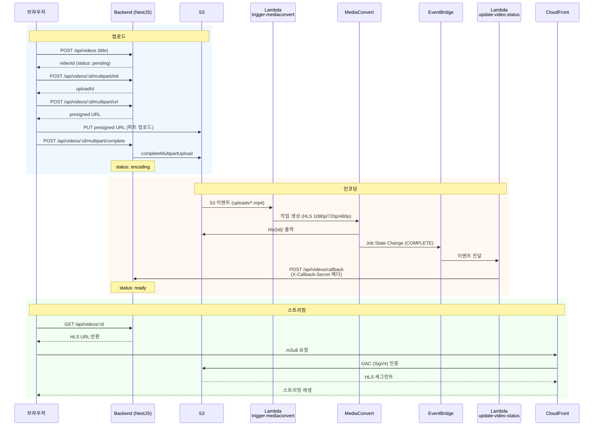

# Terraform Practice - 동영상 스트리밍 서비스

AWS 인프라를 Terraform으로 관리하는 동영상 업로드/인코딩/스트리밍 서비스.

## 기술 스택

| 영역       | 기술                                               |
| ---------- | -------------------------------------------------- |
| Backend    | NestJS, TypeORM, MySQL                             |
| Frontend   | Vue.js, Nginx                                      |
| 인프라     | Terraform, AWS (VPC, EC2, RDS, S3, CloudFront, Lambda, MediaConvert, ECR) |
| 배포       | Docker Compose, ECR, deploy.sh                     |

## 아키텍처

```
VPC (10.0.0.0/16)
├── 퍼블릭 서브넷 (10.0.1.0/24) - ap-northeast-2a
│   └── EC2 (t2.micro) + SSH 키 페어
│       └── Docker Compose
│           ├── Backend (NestJS :3000)
│           └── Frontend (Vue + Nginx :80)
├── 프라이빗 서브넷 (10.0.10.0/24) - ap-northeast-2a
└── 프라이빗 서브넷 (10.0.11.0/24) - ap-northeast-2c
    └── RDS MySQL 8.0 (db.t3.micro)

미디어 파이프라인
├── S3 (uploads/ → 원본, hls/ → 트랜스코딩 결과)
├── Lambda: trigger-mediaconvert (S3 이벤트 → 인코딩 작업 생성)
├── MediaConvert (HLS 3단계: 1080p / 720p / 480p)
├── EventBridge (인코딩 완료/실패 감지)
├── Lambda: update-video-status (콜백 → Backend)
└── CloudFront (OAC → S3 hls/* 배포)

ECR
├── backend 리포지토리
└── frontend 리포지토리
```

- EC2에서 Docker Compose로 Backend/Frontend를 실행
- RDS는 프라이빗 서브넷에 배치, EC2에서만 접근 가능
- Frontend(Nginx)가 `/api/` 요청을 Backend로 프록시
  - `/` → Vue.js 정적 파일 (HTML, JS, CSS)
  - `/api/` → Backend(NestJS, 3000번 포트)로 프록시

## 프로젝트 구조

```
terraform/
├── app/                          # 애플리케이션 코드
│   ├── docker-compose.yml        # 로컬 Docker Compose (Backend + Frontend)
│   ├── backend/                  # NestJS Backend
│   │   └── .env.docker           # 로컬 Docker용 환경변수
│   └── frontend/                 # Vue.js Frontend
├── infra/                        # Terraform 인프라 코드
│   ├── bootstrap/                # S3 버킷 + DynamoDB (원격 상태 저장소)
│   ├── modules/                  # 재사용 가능한 모듈
│   │   ├── vpc/                  # VPC, 서브넷, IGW, 라우트 테이블
│   │   ├── security/             # 보안그룹 (EC2용, DB용)
│   │   ├── rds/                  # RDS MySQL 인스턴스
│   │   ├── ec2/                  # EC2 + SSH 키 페어 + IAM 역할 + user_data
│   │   ├── ecr/                  # ECR 리포지토리 (Backend + Frontend)
│   │   ├── media/                # S3 + CloudFront OAC + MediaConvert IAM
│   │   └── lambda/               # Lambda (인코딩 트리거 + 상태 콜백)
│   ├── lambda/                   # Lambda 함수 소스코드 (Python)
│   │   ├── trigger-mediaconvert/ # S3 업로드 → MediaConvert 작업 생성
│   │   └── update-video-status/  # 인코딩 완료 → Backend 콜백
│   ├── scripts/
│   │   └── deploy.sh             # ECR 빌드/푸시 + EC2 배포 스크립트
│   └── environments/
│       └── dev/                  # 개발 환경 설정
│           ├── main.tf           # 모듈 조합
│           ├── variables.tf      # 변수 정의
│           ├── outputs.tf        # 출력값 정의
│           ├── terraform.tfvars  # 비민감 설정값 (git 추적)
│           ├── .env              # 민감한 환경변수 (git 미추적)
│           └── .env.example      # 환경변수 템플릿
├── scripts/
│   └── tf.js                     # .env 로드 + bootstrap 자동화 래퍼
└── package.json                  # yarn 스크립트 정의
```

## 사전 준비

### 1. SSH 키 페어 생성

EC2 접속 및 SSH 터널링(로컬에서 RDS 접근)에 필요하다.

```bash
ssh-keygen -t rsa -b 4096 -f ~/.ssh/terraform_practice
```

### 2. Terraform 설치

```bash
winget install HashiCorp.Terraform
```

설치 후 터미널을 재시작하여 PATH를 반영한다.

### 3. AWS IAM 설정

- IAM 사용자 생성 (`AdministratorAccess` 권한 그룹에 추가)
- 해당 사용자의 액세스 키 발급 (`Access Key ID`, `Secret Access Key`)

### 4. Node.js 및 Yarn 설치

Terraform 래퍼 스크립트(`scripts/tf.js`) 실행에 필요하다.

### 5. Docker Desktop 설치

`deploy.sh`가 로컬에서 Docker 이미지를 빌드하여 ECR에 푸시한다.

## 시작하기

### 1. 환경변수 설정

```bash
cp infra/environments/dev/.env.example infra/environments/dev/.env
```

`.env` 파일을 편집하여 실제 값을 입력:

```
# AWS 인증
AWS_ACCESS_KEY_ID=YOUR_ACCESS_KEY
AWS_SECRET_ACCESS_KEY=YOUR_SECRET_KEY

# Terraform 변수 (민감한 값)
TF_VAR_my_ip=YOUR_IP/32
TF_VAR_db_password=YOUR_DB_PASSWORD
TF_VAR_db_username=admin
TF_VAR_db_name=appdb
TF_VAR_callback_secret=YOUR_CALLBACK_SECRET
TF_VAR_public_key_path=~/.ssh/terraform_practice.pub
TF_VAR_private_key_path=~/.ssh/terraform_practice
```

### 2. 의존성 설치

```bash
yarn install
```

### 3. 인프라 배포

```bash
yarn infra:init     # Terraform 초기화 (bootstrap 자동 실행)
yarn infra:plan     # 변경사항 미리보기
yarn infra:apply    # 인프라 생성 + 앱 빌드/배포
```

### 4. 인프라 삭제

```bash
yarn infra:destroy
```

## 배포 흐름

`yarn infra:apply` 실행 시 `null_resource.deploy`가 `deploy.sh`를 호출한다.

```
deploy.sh 동작 순서:
1. Docker 데몬 실행 확인
2. AWS ECR 로그인
3. Backend 이미지 빌드 → ECR 푸시
4. Frontend 이미지 빌드 → ECR 푸시
5. EC2 SSH 접속 → 이미지 pull → docker-compose 재시작
```

EC2가 최초 생성된 경우 `user_data`가 Docker 설치와 컨테이너 기동을 처리한다.
이후 재배포 시에는 `deploy.sh`가 SSH로 직접 이미지를 교체한다.

## 동영상 업로드 흐름



미완료 업로드(pending 상태 1시간 초과)는 크론 작업이 자동 정리한다.

## 사용 가능한 스크립트

| 스크립트             | 설명                                       |
| -------------------- | ------------------------------------------ |
| `yarn infra:init`    | Terraform 초기화 (bootstrap 자동 포함)     |
| `yarn infra:plan`    | 인프라 변경사항 미리보기                   |
| `yarn infra:apply`   | 인프라 생성/변경 + 앱 빌드/배포            |
| `yarn infra:destroy` | 인프라 전체 삭제                           |
| `yarn dev:frontend`  | 프론트엔드 로컬 개발 서버                  |
| `yarn dev:backend`   | 백엔드 로컬 개발 서버                      |
| `yarn build`         | Backend + Frontend 빌드                    |

## 환경변수 관리

환경변수는 민감도에 따라 두 파일로 분리한다.

### `terraform.tfvars` — 비민감 설정값 (git 추적)

```hcl
region             = "ap-northeast-2"
project_name       = "terraform-practice-bbi"
vpc_cidr           = "10.0.0.0/16"
public_subnet_cidr = "10.0.1.0/24"
instance_type      = "t2.micro"
ami_id             = "ami-0f1e61a80c7ab943e"
```

### `.env` — 민감한 값 (git 미추적)

```
AWS_ACCESS_KEY_ID, AWS_SECRET_ACCESS_KEY
TF_VAR_my_ip, TF_VAR_db_password, TF_VAR_db_username, TF_VAR_db_name
TF_VAR_callback_secret, TF_VAR_public_key_path, TF_VAR_private_key_path
```

`scripts/tf.js`가 `.env`를 로드하여 Terraform 실행 시 환경변수로 주입한다.
`TF_VAR_*` 접두사가 붙은 변수는 Terraform이 자동으로 같은 이름의 variable에 매핑한다.

## SSH 접속

```bash
ssh -i ~/.ssh/terraform_practice ec2-user@<EC2_IP>
```

## SSH 터널링 (로컬에서 RDS 접근)

RDS는 프라이빗 서브넷에 있어 직접 접근이 불가능하다. EC2를 경유하는 SSH 터널링으로 로컬에서 접근할 수 있다.

```bash
ssh -i ~/.ssh/terraform_practice -L 3306:<RDS_ENDPOINT>:3306 ec2-user@<EC2_IP>
```

터널링 후 DB 클라이언트에서 `localhost:3306`으로 접속 가능.

DBeaver 등의 DB 클라이언트에서 SSH 탭을 통해 터널링을 설정할 수도 있다:

| 항목        | 값                          |
| ----------- | --------------------------- |
| SSH Host    | `<EC2_IP>`                  |
| SSH Port    | `22`                        |
| SSH User    | `ec2-user`                  |
| Auth Method | Public Key                  |
| Private Key | `~/.ssh/terraform_practice` |

## 보안 구성

| 구성              | 설명                                                    |
| ----------------- | ------------------------------------------------------- |
| EC2 보안그룹      | SSH(22)는 지정 IP만, HTTP(80)는 전체 허용               |
| DB 보안그룹       | MySQL(3306)은 EC2 보안그룹에서만 허용                   |
| RDS               | 프라이빗 서브넷, 공개 접근 불가, 스토리지 암호화        |
| S3                | 퍼블릭 접근 전면 차단, CloudFront OAC로만 읽기 허용     |
| CloudFront OAC    | SigV4 서명으로 S3 `hls/*` 경로만 접근 (OAI의 후속 방식) |
| Lambda 콜백       | `X-Callback-Secret` 헤더 검증                           |
| EC2 IAM 역할      | 인스턴스 프로파일로 S3/ECR 접근 (키 하드코딩 없음)      |
| MediaConvert 역할 | S3 읽기/쓰기만 허용하는 최소 권한                       |

> **OAC (Origin Access Control)**: CloudFront가 S3에 접근할 때 SigV4 서명으로 인증하는 방식이다. S3 버킷의 퍼블릭 접근을 완전히 차단하면서도 CloudFront를 통해서만 콘텐츠를 제공할 수 있다. 이전 방식인 OAI(Origin Access Identity) 대비 SSE-KMS 암호화 지원, 세분화된 정책 설정 등이 가능하여 AWS가 권장하는 현재 표준이다.

## Terraform 기본 개념

### Provider

인프라 플랫폼과의 연결을 담당하는 플러그인이다.

```hcl
provider "aws" {
  region = "ap-northeast-2"
}
```

### Resource

실제로 생성할 인프라 구성요소다. (EC2, S3, VPC 등)

```hcl
resource "aws_instance" "web" {
  ami           = "ami-0c55b159cbfafe1f0"
  instance_type = "t2.micro"
}
```

### State (상태 파일)

- `terraform.tfstate` 파일에 현재 인프라의 상태를 JSON으로 저장한다
- Terraform은 이 파일을 기준으로 **실제 인프라와의 차이**를 계산한다
- 팀 작업 시 S3 등 원격 백엔드에 저장하는 것이 일반적이다

### Variable & Output

```hcl
# 입력 변수
variable "instance_type" {
  default = "t2.micro"
}

# 출력값
output "public_ip" {
  value = aws_instance.web.public_ip
}
```

### Module

재사용 가능한 Terraform 코드 묶음이다. 디렉토리 단위로 구성한다.

### 워크플로우

```
terraform init  →  terraform plan  →  terraform apply  →  terraform destroy
```

| 명령어    | 역할                                           |
| --------- | ---------------------------------------------- |
| `init`    | Provider 플러그인/모듈 다운로드 (최초 1회)     |
| `plan`    | 코드와 상태 파일 비교, 변경 미리보기 (dry-run) |
| `apply`   | 변경사항을 실제 인프라에 적용                  |
| `destroy` | 상태 파일에 기록된 모든 리소스 삭제            |

핵심은 **선언적(Declarative)** 방식이라는 것이다. "이렇게 해라"가 아니라 **"이런 상태여야 한다"**를 선언하면, Terraform이 현재 상태와 비교해서 필요한 작업을 알아서 수행한다.

## HLS vs DASH

동영상 스트리밍에는 대표적으로 HLS와 DASH 두 가지 프로토콜이 있다.

| 항목         | HLS (HTTP Live Streaming)     | DASH (Dynamic Adaptive Streaming over HTTP) |
| ------------ | ----------------------------- | ------------------------------------------- |
| 개발사       | Apple                         | MPEG (국제 표준)                            |
| 파일 형식    | `.m3u8` 매니페스트 + `.ts` 세그먼트 | `.mpd` 매니페스트 + `.m4s` 세그먼트         |
| 브라우저     | Safari 네이티브, 나머지는 hls.js | MSE 지원 브라우저 전체 (dash.js)            |
| iOS 지원     | 네이티브                       | 미지원                                      |
| 지연 시간    | 일반 6~30초, LL-HLS로 2초 이하 | 일반 2~10초, LL-DASH 가능                   |
| AWS 지원     | MediaConvert 기본 출력         | MediaConvert 지원                           |

이 프로젝트에서는 **HLS**를 선택했다:

- iOS/Safari 네이티브 지원으로 별도 플레이어 불필요
- AWS MediaConvert의 기본 출력 형식
- hls.js로 크로스 브라우저 재생 가능
- CloudFront와의 조합이 가장 보편적

MediaConvert 출력 설정:

| 프로필 | 해상도    | 비트레이트 | 코덱         |
| ------ | --------- | ---------- | ------------ |
| 1080p  | 1920×1080 | 5 Mbps     | H.264 HIGH   |
| 720p   | 1280×720  | 3 Mbps     | H.264 HIGH   |
| 480p   | 854×480   | 1.5 Mbps   | H.264 MAIN   |

세그먼트 길이는 6초, 오디오는 AAC 128kbps 스테레오(48kHz)로 구성된다.

> - **비트레이트**: 초당 전송되는 데이터량. 높을수록 화질이 좋지만 파일 크기와 필요 대역폭이 증가한다.
> - **코덱**: 영상을 압축/해제하는 알고리즘. H.264는 가장 범용적인 비디오 코덱이며, HIGH/MAIN은 압축 효율 프로파일이다 (HIGH가 더 높은 압축률).
> - **세그먼트**: HLS는 영상을 짧은 조각(`.ts` 파일)으로 분할하여 전송한다. 6초 단위로 나뉘어 네트워크 상태에 따라 화질을 실시간 전환(ABR)할 수 있다.
